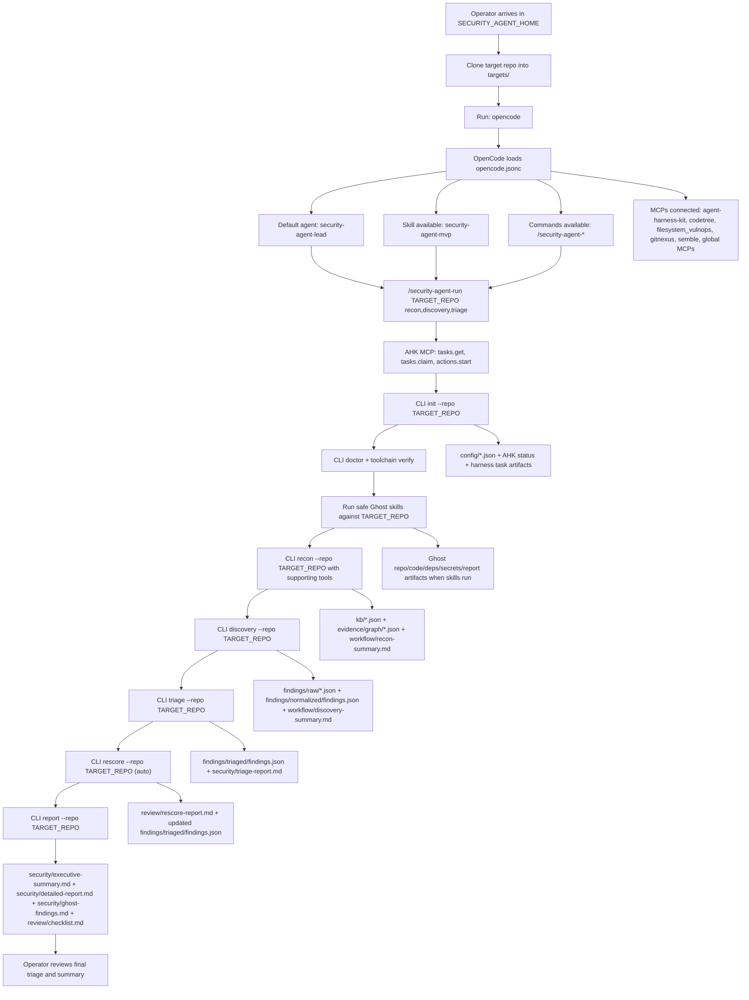
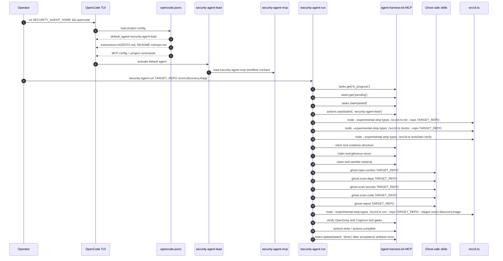
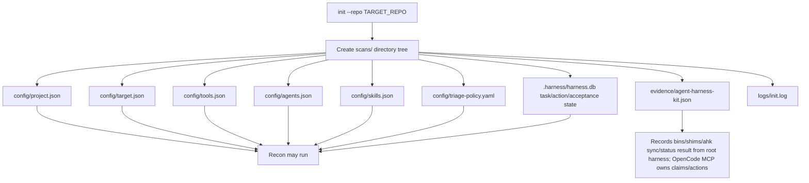
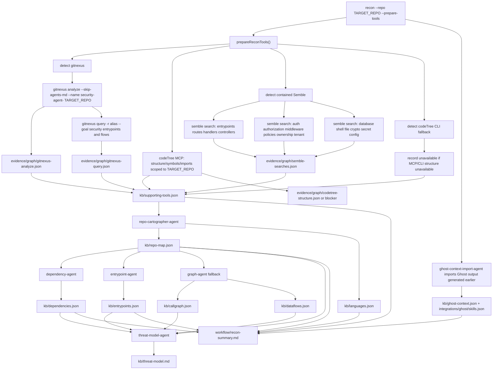
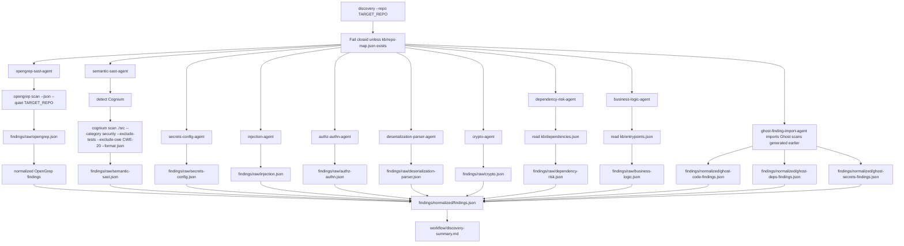
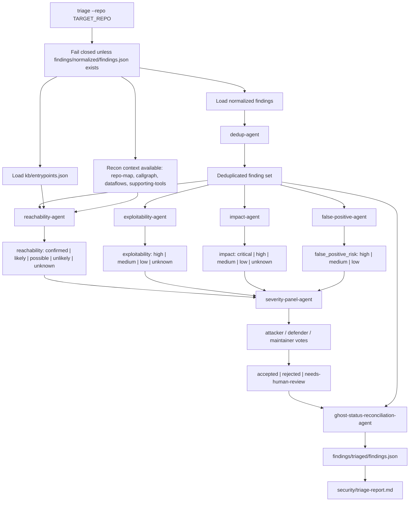
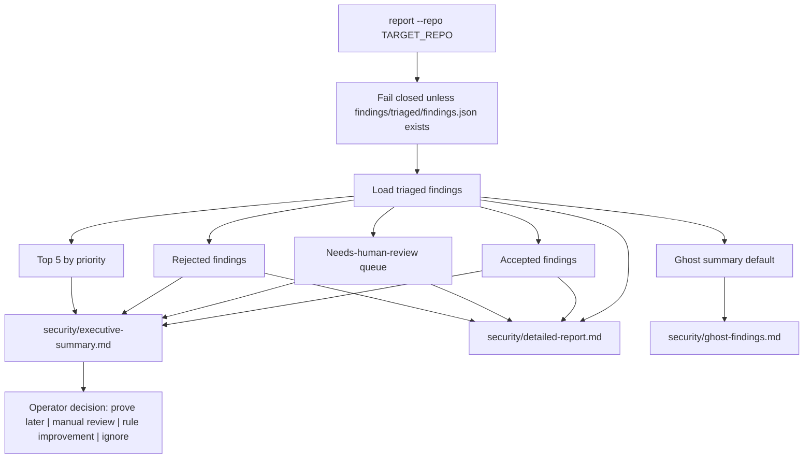
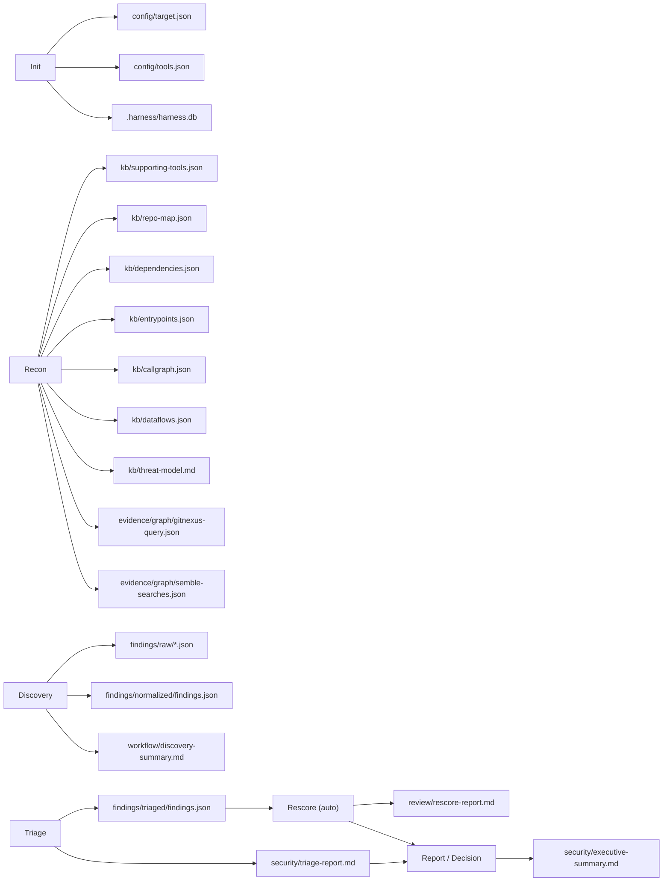

# Security-Agent Start-To-Finish Flow

This diagram shows the current MVP control flow from OpenCode startup to final report.

Path contract:

- `SECURITY_AGENT_HOME`: `${SECURITY_AGENT_HOME}` at runtime
- `TARGET_REPO`: `${SECURITY_AGENT_HOME}/targets/<reponame>` or an explicit allowed target path
- OpenCode runs in `SECURITY_AGENT_HOME`.
- Artifacts are written under `scans/<reponame>/`.

## 1. Whole Pipeline

## 2. OpenCode Loading And Command Dispatch

## 3. Init Phase

Init skill/agent usage:

- OpenCode agent: `security-agent-lead`
- OpenCode skill: `security-agent-mvp`
- CLI stage: `src/stages/init.ts`
- AHK root config: `agent-harness-kit.config.ts`
- AHK backlog source: `.harness/feature_list.json`
- Target evidence mirror: `scans/<reponame>/evidence/agent-harness-kit.json`

Init supporting tools:

- Filesystem writes only
- Git read for commit SHA when available
- `bins/shims/ahk sync --direction in`, then `bins/shims/ahk status --json`, recorded sequentially as AHK evidence

## 4. Recon Phase

Recon skill/agent usage:

- OpenCode agent: `security-agent-lead`
- OpenCode skill: `security-agent-mvp`
- CLI stage: `src/stages/recon.ts`
- Recon agents:
  - `repo-cartographer-agent`
  - `dependency-agent`
  - `entrypoint-agent`
  - `graph-agent`
  - `threat-model-agent`
- `ghost-context-import-agent` imports Ghost repo context generated by the OpenCode safe Ghost workflow

Recon supporting tools:

- GitNexus: graph/index and security-focused query evidence
- Semble: local retrieval searches
- codeTree: MCP-first structural context for symbols/functions/classes/imports/routes, scoped to `TARGET_REPO`; CLI detection remains fallback
- Ghost: active safe skills run before recon in `/security-agent-run`; recon imports their context artifacts
- RTK: operator-facing command-output reduction, not part of internal CLI execution

Recon artifacts available to later phases:

- `config/target.json`
- `kb/supporting-tools.json`
- `kb/repo-map.json`
- `kb/languages.json`
- `kb/dependencies.json`
- `kb/entrypoints.json`
- `kb/callgraph.json`
- `kb/dataflows.json`
- `kb/threat-model.md`
- `kb/ghost-context.json`
- `integrations/ghost/skills.json`
- `evidence/graph/codetree-structure.json`
- `evidence/graph/gitnexus-analyze.json`
- `evidence/graph/gitnexus-query.json`
- `evidence/graph/semble-searches.json`
- `workflow/recon-summary.md`

## 5. Discovery Phase

Discovery skill/agent usage:

- OpenCode agent: `security-agent-lead`
- OpenCode skill: `security-agent-mvp`
- CLI stage: `src/stages/discovery.ts`
- Discovery agents:
  - `opengrep-sast-agent`
  - `semantic-sast-agent`
  - `secrets-config-agent`
  - `injection-agent`
  - `authz-authn-agent`
  - `deserialization-parser-agent`
  - `crypto-agent`
  - `dependency-risk-agent`
  - `business-logic-agent`
  - `ghost-finding-import-agent`

Discovery supporting tools:

- OpenGrep: active SAST tool
- Cognium: active semantic SAST when available; runs security-only scan with tests excluded, writes unavailable artifact if missing
- Ghost: safe scan skills run before native discovery in `/security-agent-run`; discovery imports their normalized evidence by default
- Recon KB: used by dependency and business-logic discovery

Discovery artifacts available to triage:

- `findings/raw/*.json`
- `findings/normalized/findings.json`
- `findings/normalized/ghost-code-findings.json`
- `findings/normalized/ghost-deps-findings.json`
- `findings/normalized/ghost-secrets-findings.json`
- `workflow/discovery-summary.md`

## 6. Triage Phase

Triage skill/agent usage:

- OpenCode agent: `security-agent-lead`
- OpenCode skill: `security-agent-mvp`
- CLI stage: `src/stages/triage.ts`
- Triage agents:
  - `dedup-agent`
  - `reachability-agent`
  - `exploitability-agent`
  - `impact-agent`
  - `false-positive-agent`
  - `severity-panel-agent`
  - `ghost-status-reconciliation-agent`

Triage supporting tools:

- No live external tool execution in current MVP triage.
- Triage consumes artifacts produced earlier:
  - `kb/entrypoints.json`
  - `kb/callgraph.json`
  - `kb/dataflows.json`
  - `kb/supporting-tools.json`
  - `evidence/graph/gitnexus-query.json`
  - `evidence/graph/semble-searches.json`
  - `findings/normalized/findings.json`

Triage artifacts available to decision/report:

- `findings/triaged/findings.json`
- `security/triage-report.md`

## 7. Report And Decision Phase

Decision inputs:

- `security/executive-summary.md`
- `security/detailed-report.md`
- `security/triage-report.md`
- `findings/triaged/findings.json`
- `workflow/discovery-summary.md`
- `workflow/recon-summary.md`

Decision rules:

- Accepted findings may move to a future prove stage.
- `needs-human-review` findings need targeted source review or policy confirmation.
- Rejected findings should inform rule tuning.
- No PoC, live validation, proxying, patching, or AutoFix happens in the MVP.

## 8. Artifact Availability Matrix

## 9. Tool Usage Matrix

| Phase | Agent / Skill | Tool Called | Artifact Written | Used Later By |
| --- | --- | --- | --- | --- |
| OpenCode startup | `security-agent-lead`, `security-agent-mvp` | OpenCode config loader | resolved config | all commands |
| OpenCode command | `security-agent-lead`, `security-agent-mvp` | `agent-harness-kit` MCP: `tasks.get`, `tasks.claim`, `actions.start/write/complete`, `tasks.update` | AHK SQLite state and `.harness/current.md` | task ownership, audit |
| External tool gate | harness task | codeTree, GitNexus, Semble, Ghost, OpenGrep, Cognium | tool artifact or blocker artifact | prevents skipped intermediary scans |
| Init | `security-agent-mvp` | filesystem, git commit lookup, AHK SQLite | `config/*.json`, `.harness/harness.db`, `evidence/agent-harness-kit.json` | recon, all phases |
| Init | harness adapter | sequential `bins/shims/ahk sync --direction in`, `bins/shims/ahk status --json` | `evidence/agent-harness-kit.json` | operator audit |
| Pre-recon/pre-discovery | safe Ghost skills | `ghost-repo-context`, `ghost-scan-deps`, `ghost-scan-secrets`, `ghost-scan-code`, `ghost-report` | Ghost cache/artifacts, later canonical imports | recon, discovery, report |
| Recon prep | graph/recon tools | `gitnexus analyze` | `evidence/graph/gitnexus-analyze.json` | recon, triage context |
| Recon prep | graph/recon tools | `gitnexus query` | `evidence/graph/gitnexus-query.json` | recon, triage context |
| Recon prep | graph/recon tools | `bins/shims/semble search` | `evidence/graph/semble-searches.json` | recon, discovery, triage context |
| Recon prep | graph/recon tools | codeTree MCP JSON-RPC initialize and repo-map/graph calls | `evidence/graph/codetree-structure.json`, `kb/supporting-tools.json` | recon, discovery, triage context |
| Recon | `repo-cartographer-agent` | filesystem scan | `kb/repo-map.json`, `kb/languages.json` | discovery, triage |
| Recon | `dependency-agent` | manifest parsing | `kb/dependencies.json` | dependency-risk discovery |
| Recon | `entrypoint-agent` | pattern scan | `kb/entrypoints.json` | discovery, reachability triage |
| Recon | `graph-agent` | fallback lexical graph | `kb/callgraph.json`, `kb/dataflows.json` | reachability triage |
| Recon | `threat-model-agent` | KB synthesis | `kb/threat-model.md` | triage/report review |
| Discovery | `opengrep-sast-agent` | `opengrep scan` | `findings/raw/opengrep.json` | normalization, triage |
| Discovery | `semantic-sast-agent` | `cognium scan ./src --category security --exclude-tests --exclude-cwe CWE-20 --format json` | `findings/raw/semantic-sast.json` | normalization, triage |
| Discovery | focused agents | local heuristics | `findings/raw/*.json` | normalization, triage |
| Discovery | `ghost-finding-import-agent` default | Ghost import of previously generated scans | `findings/normalized/ghost-*.json` | dedup, reconciliation |
| Triage | `dedup-agent` | no external tool | deduped in memory | all triage agents |
| Triage | `reachability-agent` | reads KB artifacts | triage fields | severity panel |
| Triage | `exploitability-agent` | reads finding evidence | triage fields | severity panel |
| Triage | `impact-agent` | reads finding class/evidence | triage fields | severity panel |
| Triage | `false-positive-agent` | reads finding paths/evidence | triage fields | severity panel |
| Triage | `severity-panel-agent` | deterministic vote logic | triage votes/status | report |
| Triage | `ghost-status-reconciliation-agent` | reads external status | triage ghost notes | report |
| Rescore (auto) | `rescore-agent` | reads triaged findings + KB artifacts | `review/rescore-report.md`, updated triage scores | report |
| Report | `report-agent` | reads triaged findings | `security/executive-summary.md`, `security/detailed-report.md`, `security/ghost-findings.md` | operator decision |

## 10. Troubleshooting Checkpoints

Use these checkpoints to verify agents are following the workflow:

1. OpenCode should resolve `default_agent: security-agent-lead`.
2. `/security-agent-run` should use AHK MCP before shell execution: `tasks.get`, `tasks.claim`, `actions.start`.
3. `/security-agent-run` should call `init` before `run`.
4. `/security-agent-run` should attempt safe Ghost workflows before native recon/discovery import.
5. Complete `run` prepares recon tools by default; direct `recon` may still use `--prepare-tools`.
6. `scans/<reponame>/config/target.json` should exist after init.
7. `scans/<reponame>/evidence/agent-harness-kit.json` should record AHK sync/status.
8. `scans/<reponame>/kb/supporting-tools.json` should exist after recon.
9. `scans/<reponame>/evidence/graph/gitnexus-query.json` should exist after recon when GitNexus responds.
10. `scans/<reponame>/evidence/graph/semble-searches.json` should exist after recon when Semble responds.
11. Discovery should not run before `kb/repo-map.json` exists.
12. Triage should not run before `findings/normalized/findings.json` exists.
13. Report should not run before `findings/triaged/findings.json` exists unless `--partial` is explicit.
14. Rescore auto-triggers after triage in complete pipelines; `review/rescore-report.md` should exist after triage completes.
